<div align="center">
    <a href="https://zfile.vip">
        
    </a>
    <p>ZFile 是面向个人和小团队的在线网盘程序，可统一管理多种存储，让文件浏览、预览和分享更简单。</p>
    <p>
        <a href="https://github.com/zfile-dev/zfile/releases"></a>
        <a href="https://github.com/zfile-dev/zfile/releases"></a>
        <a href="https://github.com/zfile-dev/zfile/commits"></a>
        <a href="https://github.com/zfile-dev/zfile/issues"></a>
        <a href="https://github.com/zfile-dev/zfile/stargazers"></a>
        <a href="https://gitcode.com/zfile-dev/zfile"></a>
    </p>
    <p>
        <a href="https://zfile.vip">官网</a> ·
        <a href="https://docs.zfile.vip">文档</a> ·
        <a href="https://demo.zfile.vip">在线演示</a>
    </p>
</div>

> **版本说明：** ZFile 5.x 已发布，开源版与捐赠版已合并为同一版本。后续会剥离捐赠版代码，并将代码开源到本仓库。更新内容请查看 [更新日志](https://docs.zfile.vip/changelog/)。

## 主要特性

- 支持统一管理 S3、OneDrive、SharePoint、Google Drive、多吉云、又拍云、本地存储、FTP、SFTP 等存储源。
- 支持图片、音视频、文本、PDF、Office 和 OBJ（3D）等文件在线预览。
- 支持生成文件直链和短链，短链可设置有效期。
- 支持响应式布局，可在手机、平板和电脑等设备上使用。
- 支持多用户，可为指定用户分配存储源或目录。
- 支持常用快捷键：`Ctrl + A` 全选、`Ctrl + 左键` 多选、`Shift + 左键` 范围选择、`Esc` 取消全选等。
- 支持通过 Docker 或 Docker Compose 部署（AMD64、ARM64）。
- 支持限速下载（捐赠版）。
- 支持限制指定用户可查看、上传的文件类型（捐赠版）。

## 快速开始

使用一键安装脚本：

```bash
curl -fsSL https://docs.zfile.vip/install.sh -o install.sh
chmod +x install.sh
./install.sh
```

更多安装方式请参考 [安装文档](https://docs.zfile.vip/install/)。使用中遇到问题，可通过 [GitHub Issues](https://github.com/zfile-dev/zfile/issues) 反馈。

## 功能预览

<table>
    <tr>
        <td width="50%" align="center">
            <strong>文件列表</strong><br /><br />
            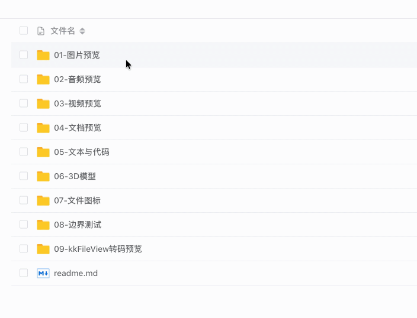
        </td>
        <td width="50%" align="center">
            <strong>画廊模式</strong><br /><br />
            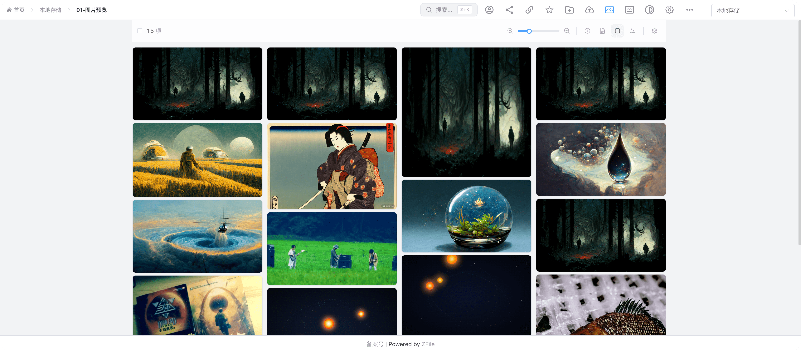
        </td>
    </tr>
    <tr>
        <td width="50%" align="center">
            <strong>视频预览</strong><br /><br />
            
        </td>
        <td width="50%" align="center">
            <strong>音频预览</strong><br /><br />
            
        </td>
    </tr>
    <tr>
        <td width="50%" align="center">
            <strong>文本预览</strong><br /><br />
            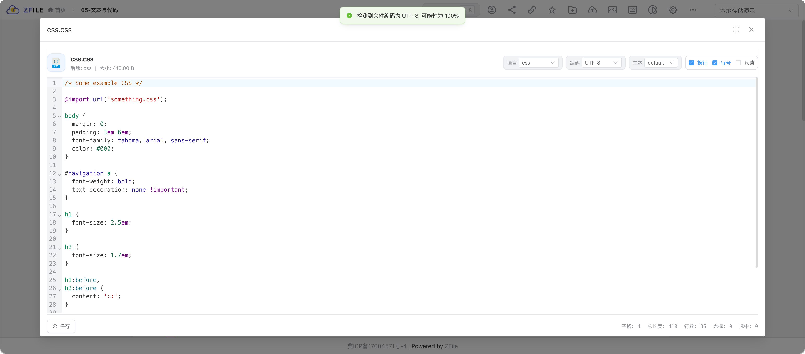
        </td>
        <td width="50%" align="center">
            <strong>PDF 预览</strong><br /><br />
            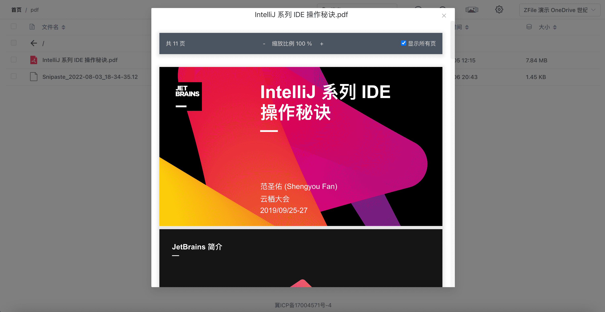
        </td>
    </tr>
    <tr>
        <td width="50%" align="center">
            <strong>Office 预览</strong><br /><br />
            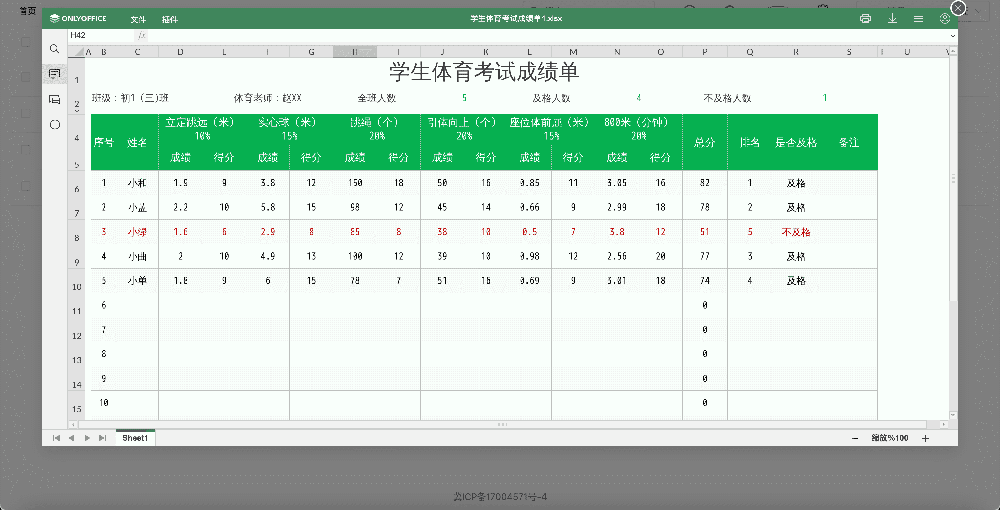
        </td>
        <td width="50%" align="center">
            <strong>3D 文件预览</strong><br /><br />
            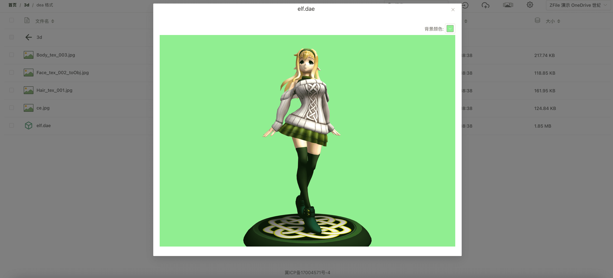
        </td>
    </tr>
    <tr>
        <td width="50%" align="center">
            <strong>生成直链</strong><br /><br />
            
        </td>
        <td width="50%" align="center">
            <strong>页面设置</strong><br /><br />
            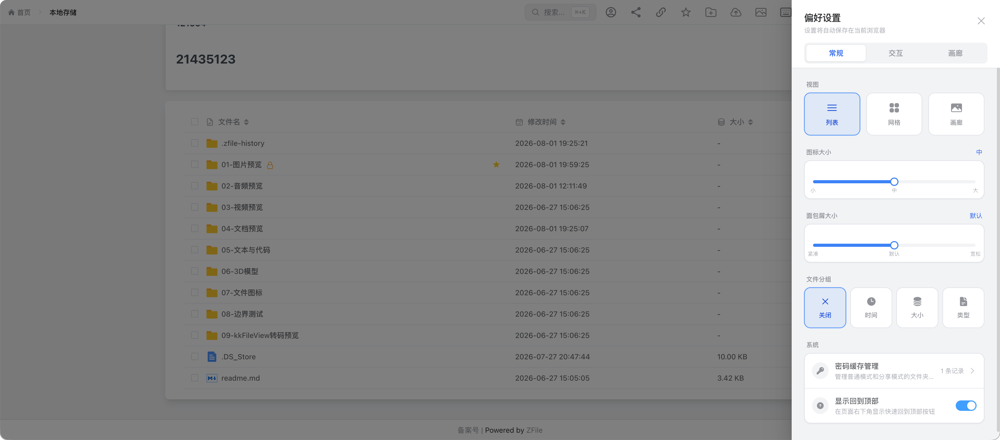
        </td>
    </tr>
</table>

<details>
    <summary><strong>查看后台管理截图（5 张）</strong></summary>
    <br />
    <table>
        <tr>
            <td width="50%" align="center">
                <strong>后台登录</strong><br /><br />
                
            </td>
            <td width="50%" align="center">
                <strong>存储源列表</strong><br /><br />
                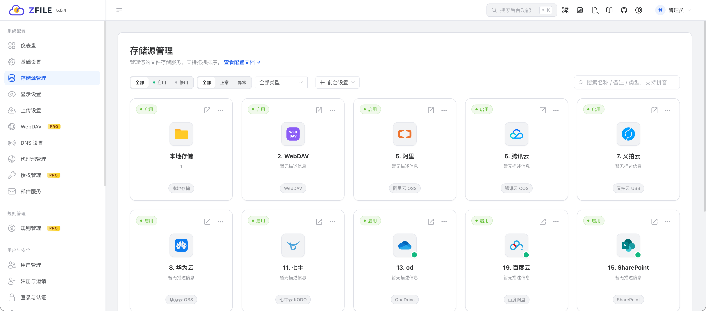
            </td>
        </tr>
        <tr>
            <td width="50%" align="center">
                <strong>添加本地存储</strong><br /><br />
                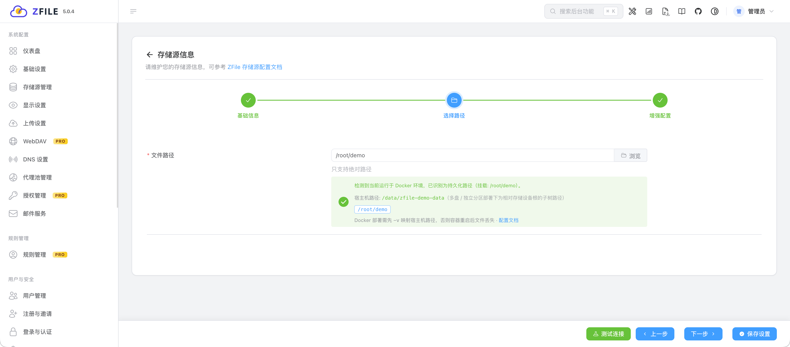
            </td>
            <td width="50%" align="center">
                <strong>用户管理</strong><br /><br />
                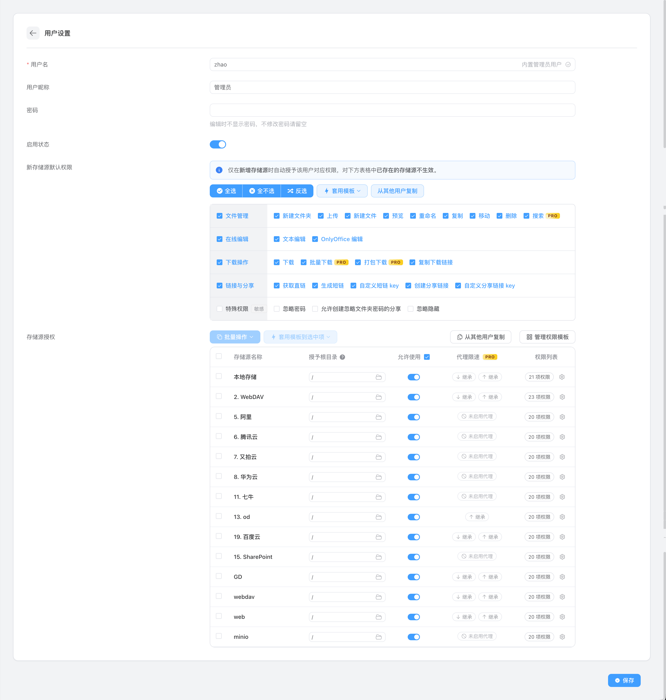
            </td>
        </tr>
        <tr>
            <td colspan="2" align="center">
                <strong>显示设置</strong><br /><br />
                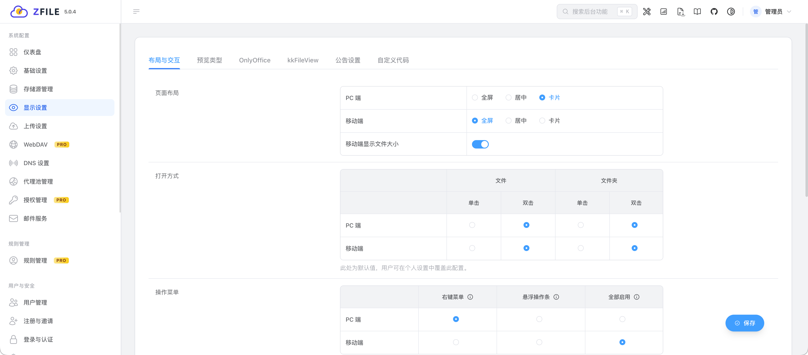
            </td>
        </tr>
    </table>
</details>

## 开源许可

本项目基于 [MIT License](./LICENSE) 开源。

## 支持作者

如果本项目对你有帮助，请作者喝杯咖啡吧。

<div align="center">
    
</div>

## Star History

<a href="https://www.star-history.com/?repos=zfile%2Fzfile%2Czfile-dev%2Fzfile&type=date&legend=top-left">
 <picture>
   <source media="(prefers-color-scheme: dark)" srcset="https://api.star-history.com/chart?repos=zfile-dev/zfile&type=date&theme=dark&legend=top-left&sealed_token=k__IUaTSa8umgKy_2j9KTqj9jvOHRCfbGjG-arR4SRc2r84LDlzlRkt-7Slk8dwkNna42CdIaeDPA79zWTJJawi1uoTzRYGa7XpL42x0pW8BfxzSLYskzy065yPr1VUKCJMJKPjBvJB376AsHUpz6s46HKoYSLgoChquT4tQYzonqNVgqBoX9gwI1b3N" />
   <source media="(prefers-color-scheme: light)" srcset="https://api.star-history.com/chart?repos=zfile-dev/zfile&type=date&legend=top-left&sealed_token=k__IUaTSa8umgKy_2j9KTqj9jvOHRCfbGjG-arR4SRc2r84LDlzlRkt-7Slk8dwkNna42CdIaeDPA79zWTJJawi1uoTzRYGa7XpL42x0pW8BfxzSLYskzy065yPr1VUKCJMJKPjBvJB376AsHUpz6s46HKoYSLgoChquT4tQYzonqNVgqBoX9gwI1b3N" />
   
 </picture>
</a>